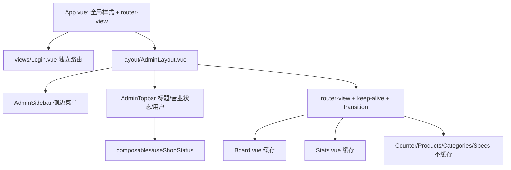

## 产品概述

对奶茶店商家后台（admin-web）全部 7 个页面做一次"只换壳、不动骨"的迭代：新增统一的左侧边栏 + 顶栏布局外壳，建立现代简约蓝灰设计体系，并做一轮以流畅度为目标的性能优化。所有页面保持现有功能、字段、业务规则与数据口径完全不变。

## 核心特性

- **统一导航外壳**：左侧固定菜单（订单看板 / 柜台点单 / 商品管理 / 分类管理 / 规格模板 / 账台统计），顶栏承载页面标题、门店营业状态与暂停接单开关、当前用户与退出登录；页面内不再出现互跳按钮。
- **现代简约蓝灰视觉**：浅灰底 + 靛蓝主色，深色侧栏形成层次，统一圆角、阴影、间距与卡片规范，替换散落各处的硬编码颜色。
- **流畅度优化**：看板轮询差量更新与高亮 CSS 化、图表按需/防抖 resize、路由懒加载分包与页面缓存、图片懒加载、切换过渡。
- **全页面覆盖**：登录页重做，看板、柜台、商品、分类、规格、统计六个业务页在保留全部交互（作废必填原因、暂停接单、取餐码 5 秒弹窗、键盘流收款、高亮 30 秒等）的前提下完成视觉与排版升级。

## 技术栈

沿用现有栈，不引入新框架：Vue 3.5（`<script setup>` + TS）、Vue Router 5、Pinia 4、Element Plus 2.14（全量引入 + CSS 变量主题化）、ECharts 6（已按需注册）、Vite 8、vue-tsc。
新增依赖仅 `@element-plus/icons-vue`（侧边栏图标）；若安装失败则回退为内联 SVG 图标组件，不阻塞改造。

## 实施思路

**策略**：分四层推进 —— 设计 token 基座 → 布局外壳（路由重构）→ 页面/组件视觉与性能 → 统一校验。业务脚本（api/、utils/、stores/）零改动，所有业务函数签名与调用链保持原样，仅调整模板结构与样式。
**关键决策**：

1. 主题化用 CSS 变量（`:root` 覆写 `--el-color-primary` 等）而非 SCSS 重编译 —— 项目无 sass 依赖，CSS 变量是 Element Plus 2.x 官方支持的轻量方案，零构建改造。
2. 路由改为 `AdminLayout` 父级 + 6 个子路由（`/login` 独立），子路由 meta 携带 `title`（顶栏标题）、`fullHeight`（柜台页整屏布局）、`keepAlive`。
3. `AdminPageHeader.vue` 就地改造为轻量标题栏（去掉 5 个互跳按钮，保留 `title` props 与右侧插槽），4 个使用方无需改 import，改动面最小。
4. 暂停接单状态与切换从 `Board.vue` 上提到 `useShopStatus` 组合式函数，由顶栏消费；看板页删除自有顶栏、用户信息与退出按钮（功能全部由外壳承接，行为一致）。

## 架构设计



## 性能与"功能不变"的边界

| 优化项 | 做法 | 不变性保证 |
| --- | --- | --- |
| 看板轮询 | 保留 3 秒轮询与 visibilitychange 暂停；订单列表按 `orderId` 复用（`v-memo` 跳过未变子树）；高亮改为 `Map<id, 到期时间戳>` 在每轮轮询中统一清理，取代 N 个 `setTimeout`；呼吸动画改用伪元素 `opacity` 动画（合成层）替代 `box-shadow` 重绘 | 新增判定、播提示音、30 秒高亮、卡片分区迁移语义完全不变 |
| keep-alive | 仅缓存 `Board`、`Stats`（组件需 `defineOptions({ name })`）；用 `onActivated/onDeactivated` 启动/停止轮询与监听器，回到页面立即刷新一次 | 与"每次进入重新取数"等价，实时性不降；Counter 不缓存以保留"离开即清空草稿"现状 |
| ECharts | 保留现有按需注册；`resize` 改 `ResizeObserver` + `requestAnimationFrame` 防抖；`deep: true` 的 watch 改为按数据长度/引用触发 `setOption` | 双轴柱+线图、数据与补零口径不变 |
| 构建/路由 | `vite.config.ts` 增加 `manualChunks`（vue/element-plus/echarts/路由页分包）；保持懒加载 | 仅影响产物分块 |
| 其他 | 商品图 `loading="lazy" + decoding="async"`、`el-image` 走 `lazy`、表格 `disable-transitions`、路由切换 120ms 淡入 | 无功能影响 |


## 目录结构

```
admin-web/
├── package.json                              # [MODIFY] 新增 @element-plus/icons-vue 依赖
├── vite.config.ts                            # [MODIFY] build.rollupOptions.manualChunks 分包
├── src/
│   ├── main.ts                               # [MODIFY] 调整样式引入顺序（EP 基础 → tokens → EP 覆写 → base），注册图标组件
│   ├── App.vue                               # [MODIFY] 移除硬编码全局样式，仅保留 router-view 与过渡容器
│   ├── styles/tokens.css                     # [NEW] 设计 token：主色/中性色/功能色/圆角/阴影/间距/字号 CSS 变量
│   ├── styles/element-theme.css              # [NEW] 覆写 Element Plus CSS 变量（primary 全色阶、圆角、边框、字体、表格/卡片观感）
│   ├── styles/base.css                       # [NEW] 全局 reset、滚动条、数字 tabular-nums、通用卡片/过渡类
│   ├── config/nav.ts                         # [NEW] 侧边菜单配置（标题/路径/图标/分组），顶栏与侧栏共用单一数据源
│   ├── layout/AdminLayout.vue                # [NEW] 外壳：侧栏 + 顶栏 + 内容区；按 meta.fullHeight 切换滚动/整屏；承载 keep-alive 与路由过渡
│   ├── layout/AdminSidebar.vue               # [NEW] 深蓝灰侧栏：Logo、el-menu router 模式、当前项高亮、可折叠
│   ├── layout/AdminTopbar.vue                # [NEW] 顶栏：折叠按钮、页面标题（meta.title）、营业状态与暂停接单开关、用户与退出
│   ├── composables/useShopStatus.ts          # [NEW] 从 Board 上提的门店营业状态读取/切换与横幅提示语（含失败回滚真值逻辑）
│   ├── router/index.ts                       # [MODIFY] 改为 AdminLayout 嵌套路由；补 meta.title / fullHeight；守卫与懒加载保持不变
│   ├── components/AdminPageHeader.vue        # [MODIFY] 去导航按钮，改为标题 + 可选副标题 + 右侧插槽的轻量页头
│   ├── views/Login.vue                       # [MODIFY] 蓝灰体系重做（左侧品牌区 + 右侧表单卡），保留账密校验与 redirect 逻辑
│   ├── views/Board.vue                       # [MODIFY] 删自有顶栏/暂停/退出，接外壳；差量更新与高亮改造；两列卡片视觉升级
│   ├── views/Counter.vue                     # [MODIFY] 顶栏精简为返回与键盘流提示；整屏两栏布局适配 fullHeight；取餐码弹窗视觉升级
│   ├── views/Products.vue                    # [MODIFY] 页头/筛选条/表格/分页视觉统一，图片懒加载
│   ├── views/Categories.vue                  # [MODIFY] 同上，表格与对话框视觉统一
│   ├── views/Specs.vue                       # [MODIFY] 规格组卡片 + 选项表格视觉升级，布局与交互不变
│   ├── views/Stats.vue                       # [MODIFY] 指标卡、渠道分布、趋势图、排行与流水网格重排（响应式栅格）
│   ├── components/board/OrderCard.vue        # [MODIFY] 取餐码排版、渠道标签、操作区与高亮动画重做（v-memo 由父级提供）
│   ├── components/board/StatBar.vue          # [MODIFY] 今日概览四数改为 KPI 卡组，口径与字段不变
│   ├── components/counter/ProductPanel.vue   # [MODIFY] 商品网格卡片、分类标题视觉升级，保留原生 button 键盘可达性
│   ├── components/counter/DraftPanel.vue     # [MODIFY] 草稿行、步进器、合计与收款按钮视觉升级，事件契约不变
│   ├── components/counter/SpecDialog.vue     # [MODIFY] 规格弹窗排版与选项态样式升级
│   ├── components/product/ProductEditDrawer.vue # [MODIFY] 抽屉表单排版与视觉统一
│   ├── components/product/SpecGroupCheck.vue # [MODIFY] 规格组勾选样式统一
│   └── components/stats/{TrendChart,RankTable,OrderFlow}.vue # [MODIFY] 图表容器与防抖 resize、表格与分页视觉统一
```

## 实施注意

- 各业务页根容器的 `padding: 16px` / `min-height: 100%` / `height: 100vh` 统一收归 `AdminLayout` 内容区，避免双重留白与滚动条嵌套。
- `Board.vue` 删除暂停接单与退出登录后，必须确认 `useShopStatus` 与 `AdminTopbar` 完整承接（含二次确认、失败回滚、loading 禁用）。
- 图标库若安装失败，用内联 SVG 组件兜底，不得因此中断改造；`npm run type-check` 与 `npm run build` 为每阶段硬性校验点。

## 设计风格

现代简约蓝灰（Modern Slate & Indigo）。深色蓝灰侧栏 + 浅灰内容区形成明确层次，靛蓝作为唯一强调色克制使用，配合统一圆角（12px 卡片 / 8px 控件）、低饱和阴影与 1px 浅边框，去掉 Element Plus 默认蓝的塑料感。所有动效控制在 120-200ms（淡入、卡片微抬升、按钮反馈），列表与卡片进出有轻微位移，让界面"活着"但不干扰收银员高频操作。数字（金额、取餐码、杯数）统一 tabular-nums 等宽对齐。

## 页面规划

### 1. 登录页

- **背景层**：靛蓝到深蓝灰的斜向渐变底 + 极淡网格纹理，底部有柔和光晕。
- **品牌卡**：居中玻璃质感卡片，Logo 圆标 + "奶茶店 · 商家后台"标题 + 一句副标语。
- **表单区**：账号/密码大号输入框（前置细线性图标），主按钮全宽、加载态保留文案。
- **底部提示**：开发环境默认账号小字提示，弱化但不删除。

### 2. 订单看板

- **今日 KPI 条**：四张并排指标卡（营业额/订单数/杯数/退款额），主指标带色条与图标，退款额非 0 时转警示色。
- **状态横幅**：暂停接单时顶部黄色条幅（含顾客端提示语），顶栏开关同步。
- **双列订单区**：待制作 / 制作中两列，列头带数量徽标；空态用插画式空状态。
- **订单卡片**：超大等宽取餐码 + 渠道标签 + 商品明细 + 金额 + 等待/制作分钟数；新单描边呼吸高亮；底部主/次操作按钮等宽铺满。

### 3. 柜台点单

- **顶栏提示条**：返回入口、暂停接单标签、键盘流说明（点商品 → 回车 → Ctrl+Enter 收款）。
- **左侧商品区**：分类标题 + 自适应商品网格卡片（缩略图、名称、起价），hover 抬升、focus-visible 描边保留键盘可达性。
- **右侧草稿区**：草稿行（名称/规格/步进器/金额/删除）、整单备注、加粗合计与全宽收款按钮。
- **取餐码弹窗**：居中大卡，超大等宽取餐码 + 金额 + 倒计时提示，点击立即关闭。

### 4. 商品管理（商品/分类/规格三页同构）

- **页头**：标题 + 副说明 + 右侧主操作按钮（新建）。
- **筛选条**：分类/状态下拉 + 重置，右侧浅色说明文字。
- **数据区**：白底卡片包裹表格，斑马纹弱化、表头灰底、缩略图圆角、状态开关 inline-prompt、行操作为文字按钮。
- **分页区**：右对齐小型分页器；规格页以规格组卡片 + 选项表格双层结构呈现。

### 5. 账台统计

- **指标卡组**：四张 KPI 卡 + 渠道分布小卡（按渠道展示单量与金额）。
- **趋势卡**：近 7 日双轴图（柱=营业额，折线=订单数），卡片头部标注左右轴口径。
- **下栏双列**：商品销量排行（今日/近 7 日切换）与按日订单流水明细（含状态标签与作废原因）。
- **日期与刷新**：页头右侧日期选择器 + 刷新按钮，加载态骨架或遮罩。

## 响应式

桌面优先（收银台/后台大屏）：侧栏可折叠为图标条；内容区栅格在 1280px 以下由四列降为两列、再降为单列；看板双列在 900px 以下堆叠，柜台两栏在 1000px 以下堆叠（保留现有断点语义）。

## Agent Extensions

### SubAgent

- **code-reviewer**
- 用途：在全部页面改造完成后，对 admin-web 的改动做一次整体审查，重点核对"功能逻辑是否被意外改动"（业务函数、接口调用、交互规则）与新增布局/样式的潜在回归。
- 预期结果：输出问题清单并修正，确保 `npm run type-check` 与 `npm run build` 通过且业务行为与改造前一致。